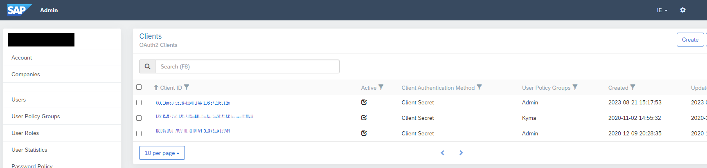
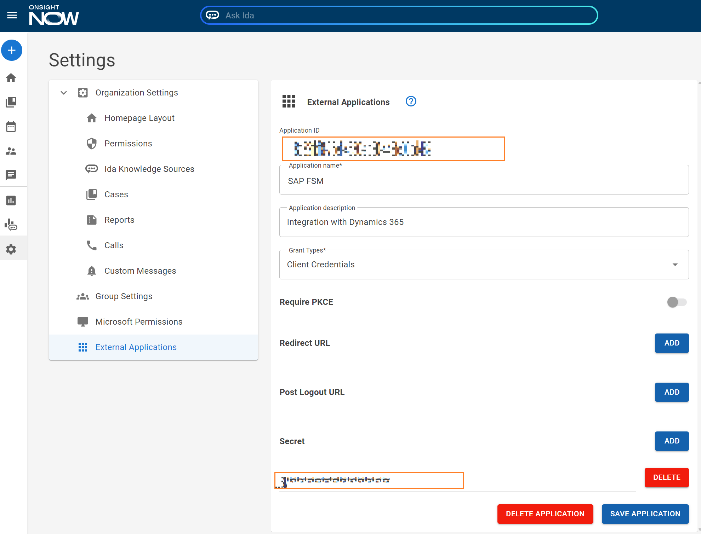
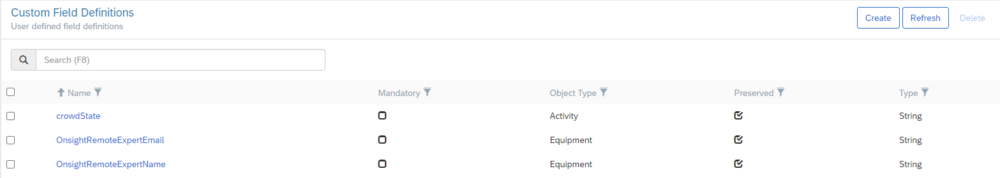
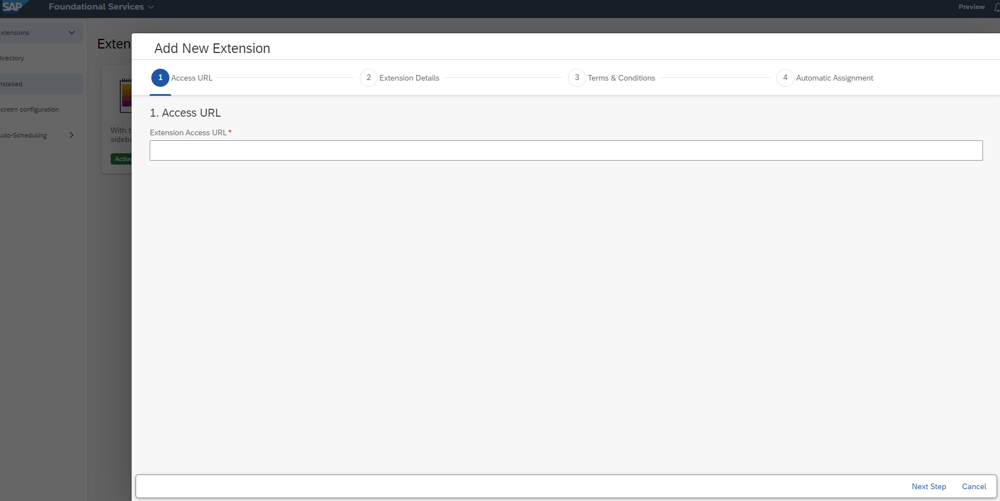
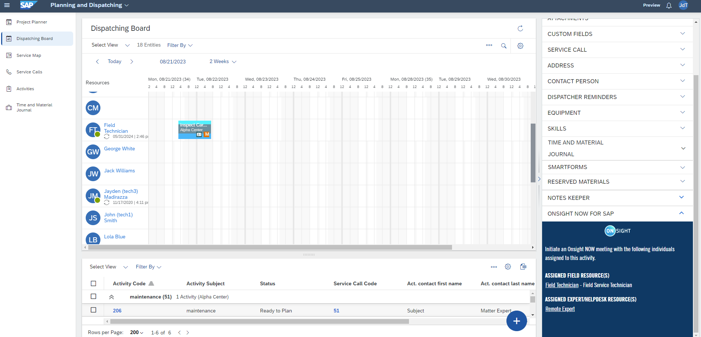

# FSM Extension for Onsight NOW

## About

- SAP FSM extensions must be run external to SAP FSM. This means that the extension runs as a standalone web app and must be publicly reachable by SAP FSM.
- The Onsight NOW extension operates on FSM Activities which are typically part of Service Calls.
  - When the user selects an Activity within the Dispatching Board, the Expert and Field Tech contacts associated with that activity are displayed in the extension UI.
  - The contact names can be clicked to initiate an instant meeting with that person.
- There are two sets of persons who can be contacted via the Onsight NOW extension:
  - The Activity's Contact.
  - The Activity's assigned Responsibles. This is the person or persons assigned to this Activity. Note that this is applicable to the FSM Web app only, as it is expected that the mobile app user is the person responsible for the selected Activity and therefore cannot call themselves.

> **NOTE:** SAP FSM Mobile application support is not currently available. There is no mechanism (as of this writing) to authenticate requests from the Mobile app to an external application, such as the Onsight NOW Extension.

### SAP FSM Client Credentials
The FSM account administrator must generate a Client ID/Client Secret pair for each FSM coresystems datacenter in which their FSM app is hosted. These credentials will be used by the Onsight extension to communicate with the FSM APIs.


### Onsight NOW Client Credentials
The Onsight NOW administrator must register the extension with NOW [as an External Application](https://demo.onsightnow.com/settings), which includes generating a Client ID and Client Secret:



### FSM Custom Fields (optional)
By default, the Onsight NOW extension will assume that the current Activity's Contact field is also the designated Remote Expert. In other words, this Contact will be callable by both the dispatcher (from the web UI) and the field worker (from the mobile UI). If this is not desirable, the extension can be configured to use custom fields, associated with the Activity's Equipment, in determining who the Remote Expert is, as noted in the following section.

   #### Defining Custom Fields in the Equipment DTO

   - Using FSM's administration pages, locate the Custom Fields page at *https://{fsmHost}/admin/accounts/{accountId}/companies/{companyId}/udfMetas*.
   - Click the Create button.
   - Enter the following values (using defaults for everything else) and click Save. This field will hold the Remote Expert's email address:
      * **Name**: OnsightRemoteExpertEmail
      * **Description**: Onsight Remote Expert Email
      * **Object Type**: Equipment
      * **Type**: String
   - Click Create again, using these values for the second field. This will be used to display the Remote Expert's name:
      * **Name**: OnsightRemoteExpertName
      * **Description**: Onsight Remote Expert Name
      * **Object Type**: Equipment
      * **Type**: String
   - You will need to edit any existing Equipment by setting values for these two custom fields. Likewise, any new Equipment that is subsequently added will also need these fields to be set
   to the Remote Expert's email address and name, respectively.



## Design

### Backend

#### appconfig.json

In order to be installable within FSM, the backend must host an *appconfig.json* from the root of the extension's backend server.
The file contains FSM Extension app configuration details and can be customized as needed.
This implementation's *appconfig.json* is located at *wwwroot/appconfig.json*.

#### AuthController

The AuthController exposes one endpoint, */auth**. This endpoint takes a SAP FSM access token, verfies it against the SAP authentication server, and returns an app "token" (a simple GUID) that is to be used when calling the OnsightController endpoints.

#### OnsightController

The OnsightController exposes two endpoints:
- GET */api/v1/contacts*: Given a DTO type and ID, looks up the contacts associated with that DTO. For example, given an Activity ID, it will return the Responsible (Field Tech) and Subject Matter Expert associated with that Activity.
- POST */api/v1/meetings*: Creates a new Onsight NOW meeting, inviting users based on their provided email addresses.
## Building

### Docker
The provided source code can be built as a Docker image. To build this image, run the following commands from the root of the source code repository:
```
cd FSMExtension
dotnet publish -t:PublishContainer -p:EnableSdkContainerSupport=true
```
This will build and register a Docker image named *fsmextension* on the local build machine.

### Web Server
The extension can also be deployed to a web server, such as IIS. The extension is an ASP.NET 8 project and can be deployed like any other ASP.NET web app.

## Deploying

Whether deploying as a Docker container or through a web server, the extension will require the following environment variables to be set:
- **SAP_FSM_ACCOUNT_NAME**: your SAP FSM account name
- **SAP_FSM_CLIENT_ID**: the SAP Client ID generated [above](#sap-fsm-client-credentials)
- **SAP_FSM_CLIENT_SECRET**: the SAP Client Secret generated [above](#sap-fsm-client-credentials)
- **ONSIGHT_NOW_CLIENT_ID**: the Onsight NOW Client ID generated [above](#onsight-now-client-credentials)
- **ONSIGHT_NOW_CLIENT_SECRET**: the Onsight NOW Client Secret generated [above](#onsight-now-client-credentials)

### Docker
The Docker image can be run using the following command:
```
docker run -p 8080:8080 \
    -e SAP_FSM_ACCOUNT_NAME='<YourSAPFSMAccountName>' \
    -e SAP_FSM_CLIENT_ID='<SAPFSMClientId>' \
    -e SAP_FSM_CLIENT_SECRET='<SAPFSMClientSecret>' \
    -e ONSIGHT_NOW_CLIENT_ID='<OnsightNowClientID>' \
    -e ONSIGHT_NOW_CLIENT_SECRET='<OnsightNowClientSecret>' \
    fsmextension
```

Be sure to replace the environment variables with your applicable values.

## Installing

After the extension app has been deployed, it must be installed into your SAP FSM tenant. This is done through the Extensions section under *Foundational Services*:
[Extensions Page](https://{fsmHost}/shell/#/foundational-services/extension-management/extensions).

Clicking the "Add Extension" button brings up the *Add New Extension* wizard. In Step 1, the *Extension Access URL* is the public endpoint of your extension app.



Assuming that the endpoint can be reached, SAP FSM will query the extension for its appconfig.json details and will allow you to complete the *Add New Extension* wizard.


## Post-Install

Once the extension has been added to your tenant, it will be visible from the Dispatching Board (under *Planning and Dispatching*):


As the user changes their selection within the Dispatching Board, the Onsight NOW extension will reload with the contacts associated with the selected Activity.
